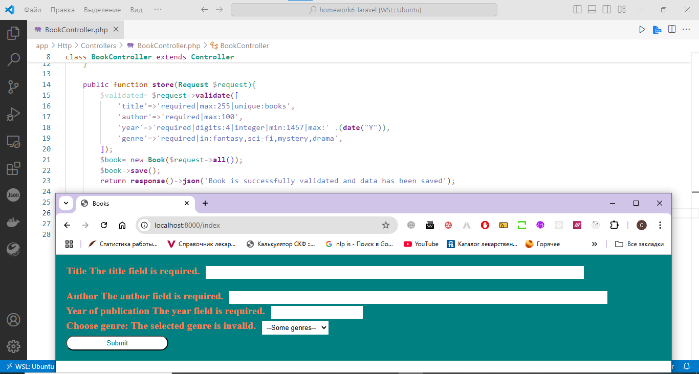
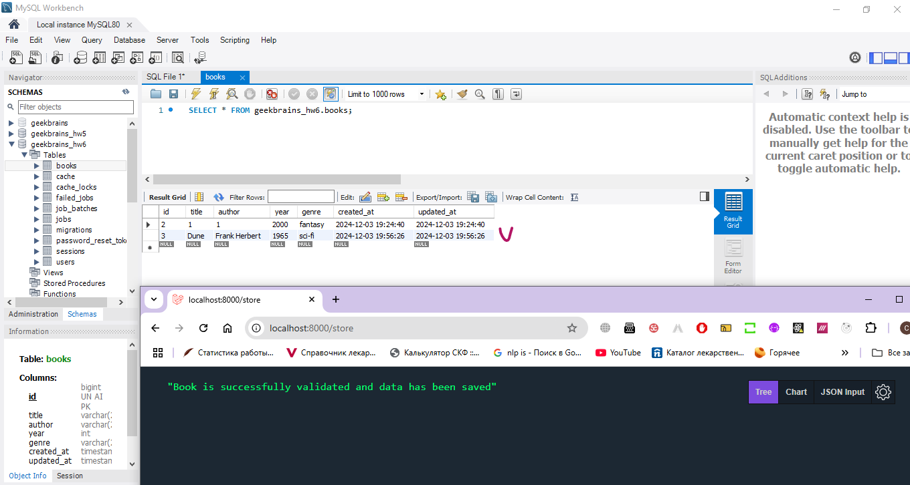

# Laravel. Homework 6. Тогочакова Евгения

В этой практической работе вы создадите форму по добавлению новой книги в книжный каталог. Форма будет создаваться внутри шаблона. 
Данные из формы будут записываться в соответствующие поля базы данных с помощью модели Eloquent.

1. Внутри директории resources/view корневого каталога проекта создайте новый блейд-шаблон с именем form.blade.php.
Должны быть указаны поля с названием книги, именем автора, а также жанр, который можно выбрать из списка. Вы также можете добавить произвольные поля, чтобы сделать данные из формы более комплексными и приближенными к реальности.

2. Чтобы защитить данные формы от межсайтовой подделки запроса, добавьте внутрь формы CSRF токен. 
Напомним, сделать этом можно с помощью директивы @csrf или скрытого поля input

3. Свяжите данные полей формы с моделью Laravel. 

4. Чтобы данные из формы корректно записывались в соответствующие поля базы данных, опишите схему базы данных в методе up().
Чтобы в базе данных появились соответствующие поля, не забудьте повторно запустить миграции в базе данных, воспользовавшись соответствующей командой artisan.

5. Внутри файла /routes/web.php опишите новый роут (метод GET), который будет вызывать метод index контроллера BookController по url /index. 
Также добавьте роут с методом POST, который будет вызывать метод store того же контроллера BookController с url** /store**

6. Опишите метод index внутри контроллера BookController. Метод должен возвращать представление формы в браузере.

7. Опишите метод store(). Прежде чем сохранить данные внутри модели, проведите валидацию с помощью метода $request->validate(). Правила для валидации:
— все поля обязательны к заполнению, без пустых строк и пробелов в качестве единственного значения;
— максимальное число символов в имени автора — 100, в названии книги — 255;
— название книги должно быть уникальным значением в модели Book.

8. Добавьте обработку ошибок при некорректной валидации.

